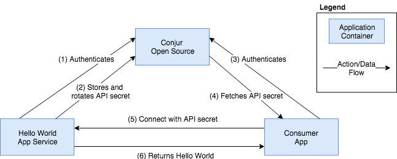

# Conjur Rotation Demo

This example application system demonstrates using Conjur to store,
rotate, and fetch the the application secret required to access a 
protected system application. 




- **Conjur Open Source**  

    Conjur Open Source provides the service authentication and secret 
    storage for the system.  

- **Hello World App Service**

    Hello World is the protected application service. When Hello World 
    receives an authenticated request at its root path (`/`), it will
    respond with the message `Hello World!`.

    Hello World generates its own authentication token secret when started,
    and will store this secret in Conjur as the variable `helloworld-secret`.

- **Consumer App**

    The Consumer application connects to Hello World to request the
    response message using the authentication secret, `helloworld-secret`,
    fetched from Conjur.


## Prerequisites

To run this system demo, you will need:

1. Docker and Docker Compose

## Running the Demo

1. Start Conjur Open Source
    This will create the containers for Conjur and the application services
    and start the Conjur service.
    > NOTE: This command will also clean up any previous application state and
    > reset the system
    ```
    $ ./start
    database uses an image, skipping
    conjur uses an image, skipping
    Building helloworld
    ...
    Successfully built 03651f06a263Successfully tagged conjurorg-rotation-demo:latest
    conjur-cli uses an image, skipping
    Creating network "conjurorg-rotation-demo_default" with the default driver
    Creating conjurorg-rotation-demo_database_1 ... done
    Creating conjurorg-rotation-demo_conjur_1   ... done
    ```

2. Load the Conjur policy
    > NOTE: After the first run of the demo, you will be prompted to overwrite
    > the local conjur-cli configuration. You should enter `yes` for this prompt.
    ```
    $ ./load-policy
    Starting conjurorg-rotation-demo_database_1 ... done
    Starting conjurorg-rotation-demo_conjur_1   ... done
    Wrote configuration to /root/.conjurrc
    Fetching API key...
    API key ready
    Starting conjurorg-rotation-demo_database_1 ... done
    Starting conjurorg-rotation-demo_conjur_1   ... done
    Logged in
    Starting conjurorg-rotation-demo_database_1 ... done
    Starting conjurorg-rotation-demo_conjur_1   ... done
    Loaded policy 'root'
    {
    "created_roles": {
        "demo:host:helloworld": {
        "id": "demo:host:helloworld",
        "api_key": "18m8g7b3hpxcsvweer2yh1dr6zkv5pw41n2w2aq380r0kzwfvvfe"
        }
    },
    "version": 1
    }
    ```

3. Start the **helloworld** application service
    ```
    $ ./start-helloworld
    Starting conjurorg-rotation-demo_database_1 ... done
    Starting conjurorg-rotation-demo_conjur_1   ... done
    Starting conjurorg-rotation-demo_database_1 ... done
    Starting conjurorg-rotation-demo_conjur_1   ... done
    Creating conjurorg-rotation-demo_helloworld_1 ... done
    ```

4. Call the **helloworld** service, using Conjur to deliver the **helloworld** application secret
    ```
    $ ./connect
    Starting conjurorg-rotation-demo_database_1 ... done
    Starting conjurorg-rotation-demo_conjur_1   ... done
    Connecting with API secret: 168d6054dce1876e528e86cde4d984ea81299674
    Hello world!
    ```

5. Rotate the **helloworld** application secret and restart the service.
    > NOTE: This will cause **helloworld** to update Conjur with the new secret.
    > You should expect to see `./connect` display a different API secret
    > from the previous execution.

    ```
    $ ./rotate
    Stopping conjurorg-rotation-demo_helloworld_1 ... done
    Going to remove conjurorg-rotation-demo_helloworld_1
    Removing conjurorg-rotation-demo_helloworld_1 ... done
    Starting conjurorg-rotation-demo_database_1 ... done
    Starting conjurorg-rotation-demo_conjur_1   ... done
    Starting conjurorg-rotation-demo_database_1 ... done
    Starting conjurorg-rotation-demo_conjur_1   ... done
    Creating conjurorg-rotation-demo_helloworld_1 ... done

    # Executing connect again will use the updated app secret from Conjur
    $ ./connect
    Starting conjurorg-rotation-demo_database_1 ... done
    Starting conjurorg-rotation-demo_conjur_1   ... done
    Connecting with API secret: f295fb473056805692373bbfc314362d9e78e377
    Hello world!
    ```

6. An unauthorized service request can be issued using connect with `--fail`
    ```
    $ ./connect --fail
    Unauthorized
    ```
